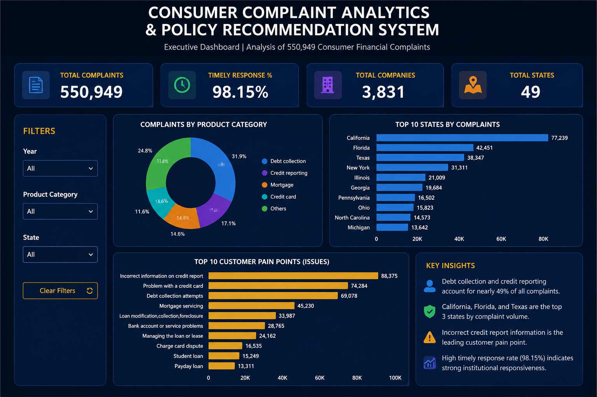

# Consumer Complaint Analytics & Policy Recommendation System

## 📌 Project Overview

This project analyzes over **550,000 consumer financial complaints** to identify complaint trends, customer pain points, service quality issues, and business improvement opportunities across major financial institutions.

The project involves data cleaning, exploratory data analysis (EDA), KPI generation, and Power BI dashboard development.

---

## 🎯 Business Objectives

* Analyze complaint patterns across financial products.
* Identify the most common consumer issues.
* Evaluate complaint handling efficiency.
* Compare complaint volumes across states.
* Identify companies receiving the highest complaint volumes.
* Generate data-driven recommendations for improving customer experience.

---

## 🛠️ Tools & Technologies

* Python
* Pandas
* NumPy
* Power BI
* Git
* GitHub

---

## 📊 Dataset Summary

| Metric                 | Value   |
| ---------------------- | ------- |
| Total Complaints       | 550,949 |
| Financial Institutions | 3,831   |
| Timely Response Rate   | 98.15%  |

### Product Distribution

| Product                  | Complaints |
| ------------------------ | ---------: |
| Loans                    |    228,599 |
| Credit Card Services     |    163,710 |
| Bank Accounts & Services |    158,640 |

---

## 🔍 Key Insights

### Top Complaint Categories

* Managing an account
* Trouble during payment process
* Problem with a purchase shown on statement
* Dealing with lender or servicer
* Struggling to pay mortgage

### Top States by Complaint Volume

1. California
2. Florida
3. Texas
4. New York
5. Georgia

### Top Financial Institutions by Complaint Volume

* Wells Fargo & Company
* JPMorgan Chase & Co.
* Bank of America
* Citibank
* Capital One Financial Corporation

---

## 📈 Dashboard Preview

> Dashboard development is currently in progress.



---

## 📂 Repository Structure

```text
RBI_COMPLAINT_PROJECT
│
├── scripts
│   └── filter_rbi_dataset.py
│
├── powerbi_dashboard
│
├── images
│   └── dashboard_preview.png
│
├── README.md
├── requirements.txt
└── .gitignore
```

---

## 🚀 Future Enhancements

* Interactive Executive Dashboard
* Complaint Trend Forecasting
* Sentiment Analysis
* Risk Scoring Framework
* Automated Recommendation Engine

---

## 👩‍💻 Author

**Gauravi Thakur**

MBA (Analytics & Data Science)

Power BI | Python | Data Analytics | Business Intelligence
